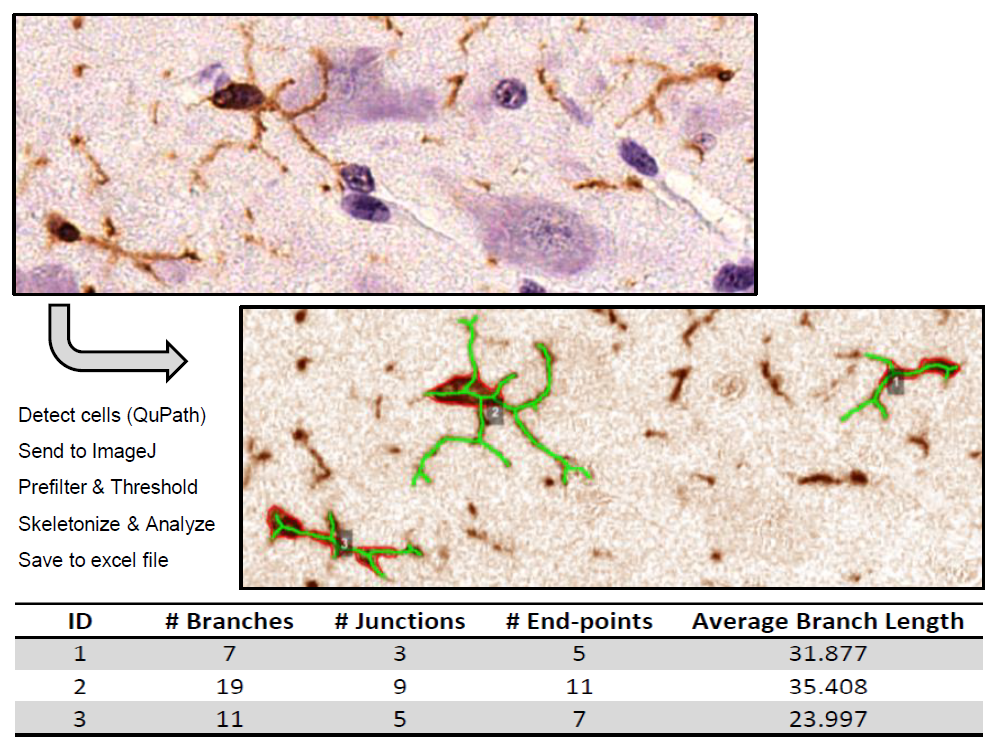

# Microglia Morphology Analysis

## Overview

The scripts provided in this repository automate the analysis of microglia cell morphology in H-DAB stained images using QuPath and ImageJ. They identify microglia soma body cells within a user-defined annotated region and analyze their morphology, including metrics such as the number of branches and junctions. The scripts save the results in Excel tables for further statistical analysis and overlay the resulting cell skeletons as annotations in QuPath, enabling visual verification of the computations. The soma body cell detection and annotation management are handled by QuPath, while subsequent image processing, thresholding, skeletonization and analysis are performed by ImageJ.

    
    
<b>Figure</b>: The process workflow - From the input H-DAB image to the resulting skeleton overlay and morphology table.

### Requirements

- **Image Type**: Brightfield images with standard stain color vectors (DAB & Hematoxylin).
- **Software**:
    - **QuPath**: For cell detection and annotation management
    - **ImageJ/Fiji**: For image preprocessing, thresholding, skeletonization and analysis. Furthermore, ImageJ requires the installation of the plugins for Skeletonization and Auto Local Thresholding (included in the Fiji version of ImageJ)

### Results

The script generates three Excel tables for each analyzed image and region:

- **Full Skeletonization Results**: Contains the raw skeletonization data for each detected microglia cell, including metrics like the number of branches, junctions, and average branch length. Each table row corresponds to an individual soma body cell.
- **Statistics Summary**: Provides a summary of the mean values for all morphological metrics, the total annotation area (in pixels and microns), and the total count of detected soma body cells.
- **Parameters Table**: Lists all functional parameters (e.g., cells_min_area, gaussian_sigma) used in the analysis, along with their specific values. This table ensures reproducibility and can be referenced in publications to provide the technical details of the analysis.
                                         

## Installation

1. Install QuPath (https://qupath.github.io/)
2. Install ImageJ / Fiji (https://imagej.net/software/fiji/downloads). Download the zipped folder, unzip folder and move Image-J folder to the desired directory, e.g. under C:/Program Files (x86)
3. Setup ImageJ Plugins in QuPath:
    1. Copy the path to the plugins directory of ImageJ (should look sth. like this: *\<Path-to-Fiji-installation\>/Fiji/plugins*)
    2. In the QuPath menu bar, select "Extensions" -> "ImageJ" -> "Set plugins directory", then choose the folder path copied in the previous step
    3. Press "Select Folder", then close QuPath & re-open QuPath again (program needs to be closed to update the changes)
4. The Fiji-distribution of ImageJ should already contain all necessary plugins to run this script, but if some are missing, e.g. "Auto Local Threshold", do the following:
    1. Go to ImageJ Wiki (https://imagej.net/list-of-extensions) & search for the missing extension / plugin (e.g. Auto Local Threshold is found under: https://imagej.net/plugins/auto-local-threshold)
    2. Follow the installation instructions on the wiki page (There should be a link to download the plugins file. The downloaded file has to be copied to the  ImageJ-plugins directory, i.e. *\<Path-to-Fiji-installation\>/Fiji/plugins*)
5. The most recent version of this script uses a Color Deconvolution plugin. Installation is as follows:
    1. Download the plugin from this github repository: https://github.com/landinig/IJ-Colour_Deconvolution2/blob/main/colour_deconvolution2.jar
    2. Place the downloaded file inside the ImageJ-plugins directory (*\<Path-to-Fiji-installation\>/Fiji/plugins*)
    3. You may have to close and re-open QuPath for the new plugin to be detected

## Usage Guide: Single Image Analysis
Use the script `microglia_morphology_single_image.groovy` and follow these instructions if you only want to analyze a single image or to find good parameters for cell detection and thresholding before running the analysis on multiple images. Running the script in batch-mode for multiple images is explained
 [here](#usage-guide-analyzing-multiple-images-batch-mode).

1. **Open Project**
    - **Case A) First time setup** (Setting up a new QuPath project)
        1. Create a new folder to store the QuPath project
        2. Open QuPath, then go to the "Project" tab in the left panel, then press "Create Project"
        3. Select the folder created in step 1.1
    - **Case B) Existing QuPath Project** (Script was used before on this machine)
        1. Open QuPath, then go to the "Project" tab in the left panel, then press "Open Project"
        2. Select your existing project folder, open this folder, then select the file called "project.qpproj" and press "open"

2. **Add Images to Project**
    1. Drag & Drop images into the left panel under "Project" (this will open another window, confirm by pressing "Import").
    2. A window with "Set image type" will pop up. Select "Brightfield H-DAB", then press "Apply"
    3. The images should then appear in this panel "Image List". An image can be opened by double-clicking on its name

3. **Draw Annotation Region**
    1. Zoom into the region of interest, then select one of the buttons with red forms (under the uppermost main menu bar). These are the annotation tools. The 6th from the left, the "brush tool", is especially useful, since it allows to freely draw
    2. Draw annotation region (Having selected one of the drawing tool buttons, just left-click with the mouse to draw). Here are some tips:
        - **Change brush size:** The size of the brush adapts according to the magnification level, i.e. if you zoom in, the brush effectively paints small regions - while zoomed out it can quickly mark large areas
        - **Delete annotation:** Go to the "Annotations" tab, select the relevant annotation (should be highlighted in yellow), then press the "delete" button below the annotation list (or just press "delete" on the keyboard)
        - **Extend annotation:** Go to the "Annotations" tab, select the relevant annotation (highlighted in yellow). Click inside the annotation, then hold the left mouse button and draw to extend the region
        - **Erase parts of annotation:** Holding down the Alt-key while using the brush causes it to ‘subtract’ regions, basically acting as an eraser
        - For further info & tips, check the official [QuPath Annotation Documentation](https://qupath.readthedocs.io/en/0.3/docs/starting/annotating.html)

4. **Open the script inside QuPath**
    1. In the QuPath main menu, click "Automate" -> "Script Editor" to open the script editor.
    2. Inside the Script editor, press "File" -> "Open", then navigate to the script file location and select the script file (Alternatively, you can drag & drop the script file directly into the left panel ("Scripts") of the script editor)

5. **Run script**
    1. Select & open the script from the list of scripts in the left panel
    2. Choose a directory where all results should be saved:
        - Create a results folder, copy its path, and insert the path in line 117 (i.e., `excel_save_path = "<your-copied-path/results>"`)
        - (Note: If your copied path contains backslashes `\`, you need to replace them with forward slashes `/`)
    3. Choose a name under which the Excel table results for the current image should be saved:
        - Write the name in line 115, e.g., `excel_save_name = "Microglia_Img_1_dorsal_region"`
        - IMPORTANT: Every time you run the script on a new annotated region in the same image, you should use a new name! (otherwise, it will overwrite the previous results)
    4. Optional: Adapt the functional parameters for the soma cell detection & ImageJ preprocessing, thresholding & skeletonization. For example, if you also want to detect soma cells that are very small, decrease the cells' minimum area (e.g., `cells_min_area = 12.0`)
    5. Save changes: In the script editor menu, click "File" -> "Save"
    6. Select the annotation region in the image for which you want to run the script (if it is selected, it is highlighted in yellow)
    7. Press "run" (in the bottom right corner of the script editor)
    8. While the script is running, you can see what is currently computed by viewing the log in the lower part of the script editor. The last printed log is "INFO: DONE!", this signalizes that the script is done computing. You can now open & view the resulting Excel tables in your results folder (Note: You may have to close QuPath first in order to edit the Excel tables)

## Usage Guide: Analyzing Multiple Images (batch mode)
Use the script `microglia_morphology_batchmode.groovy` if you want to analyze multiple images at once using QuPath's batch-mode. Before running the batch analysis for multiple images, it’s recommended to first determine the optimal parameters using the script for single image analysis as described [above](#usage-guide-single-image-analysis).

The process for batch analysis is almost identical to the [single image analysis](#usage-guide-single-image-analysis), with the following adjustments:

- **Add Images to Project**: Ensure that all images you want to analyze are added to your QuPath project (see point 2 in the [single image analysis guide](#usage-guide-single-image-analysis)).
- **Output Path**: You don’t need to specify a name for the resulting Excel file(s). Instead, provide the path to a folder where the results for all images should be saved (line 115: `excel_save_path = "<path-to-your-datafolder>/Results"`).
- **Annotations**: The batch-mode script expects pre-made annotations that are named for each image. Before running the script:
    - Add each image to your QuPath project, open it and draw annotations for the regions you want to analyze.
    - Name each annotation by first selecting (double-click) then right-clicking on it, selecting "Annotations" > "Set properties," and typing a name in the window that appears. Press "Apply" when done.
    - Note: You can create multiple annotations for each image. The script will analyze each annotation region per image individually.
- **Parameter Adjustment**: Update the parameters in lines 119-145 according to the optimal settings you identified while testing the script on a single image using `microglia_morphology_single_image.groovy`.
- **Run the Script**: Once you’ve added all images, drawn and named annotations, and updated the parameters, you’re ready to run the script. Depending on the size of your images and annotation regions, the analysis may take some time. Once the analysis is complete, you’ll find all results in the specified results folder (line 115). The script will create a separate folder for each processed image and annotation region in the following format: *YYYY-MM-DD_Microglia_Img[image-name]_region[annotation-name]*, containing three Excel tables (the selected parameters, the full raw skeletonization results and the statistics summary).

---

**Closing Remarks:**
- The scripts internally switch the DAB & Hematoxylin-channel to run the QuPath cell detection algorithm on the DAB-channel (since QuPath's cell detecion algorithm is only implemented for the Hematoxylin channel)
- If any errors occur or something is unclear, feel free to contact me under jume@di.ku.dk
